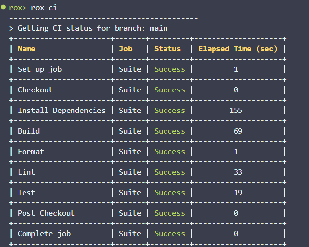
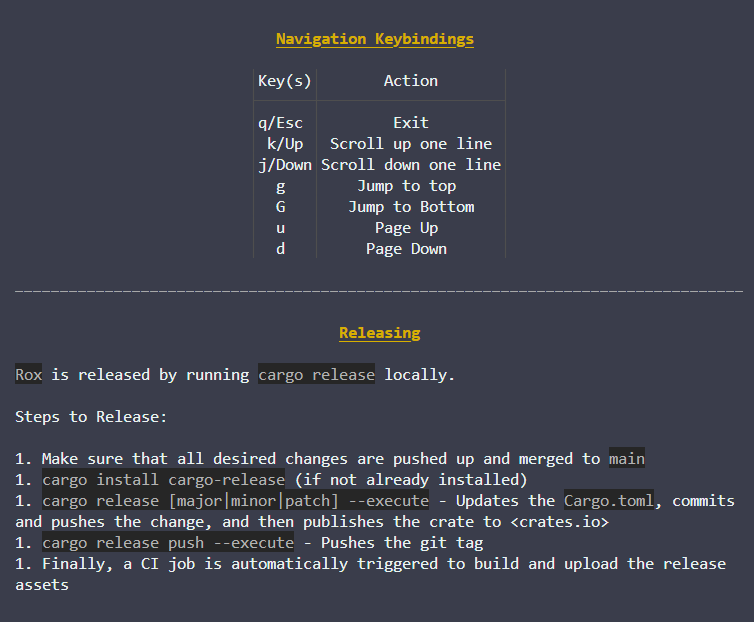
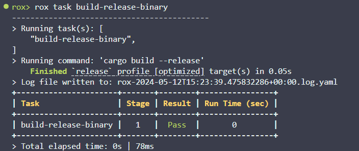
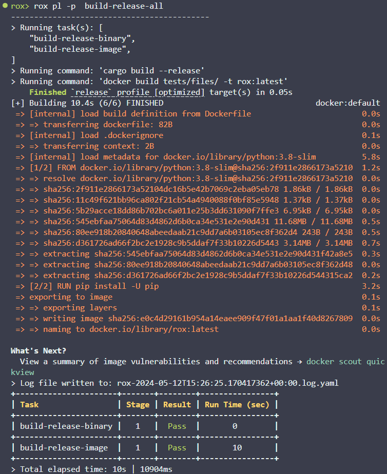
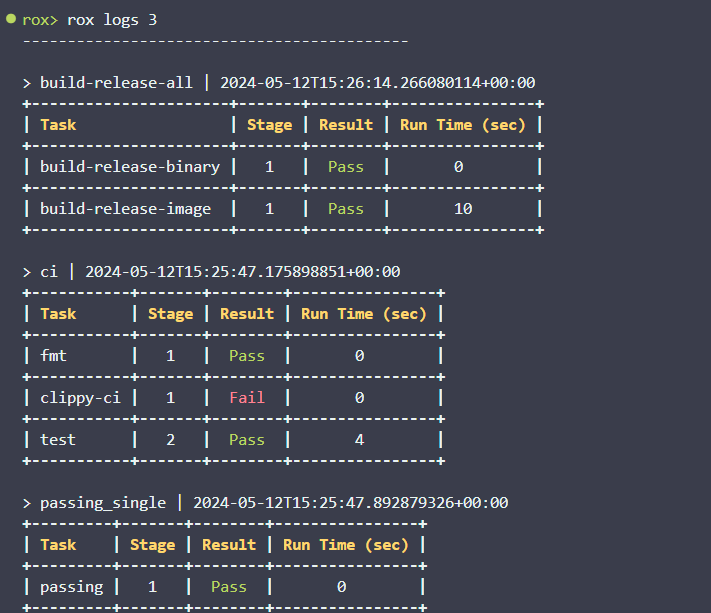

# Rox


[](https://github.com/ThomasLaPiana/rox/actions/workflows/checks.yml)

Rox is a robust developer workflow framework inspired by [Nox](https://nox.thea.codes/en/stable/), Make & [cargo-make](https://github.com/sagiegurari/cargo-make)

Rox gives you the ability to build your own devtools CLI using YAML files, check CI pipeline statuses from your terminal, and even read documentation. Tasks and Pipelines are dynamically added to the CLI as subcommands at runtime. The flexibility of `rox` intends to makes it easier for dev teams to standardize their workflows without writing endless "glue" scripts.

## Table of Contents

- [Why Rox?](#why-rox)
- [Installation](#installation)
- [Roxfile Syntax](#roxfile-syntax)
  - [CI](#ci)
  - [Docs](#docs)
  - [Templates](#templates)
  - [Tasks](#tasks)
  - [Pipelines](#pipelines)
  - [Logs](#logs)
- [Putting it all Together](#putting-it-all-together)

## Why Rox?

Rox was created for the purpose of making building and developing applications easier. It is designed to focus on extensiblity, performance, and documentation. Here are a few of the key features that help Rox achieve that goal:

- **Dynamically Generated CLI**: Rox's subcommands are dynamically added to the CLI at runtime. Configuration is handled entirely via YAML.
- **Powerful Primitives**: Using a combination of Rox's primitives (`Tasks`, `Pipelines` and `Templates`, etc.) it is possible to handle virtually any use-case with minimal boilerplate.
- **Documentation as a First-Class Feature**: Names and descriptions are automatically injected into the CLI at runtime, so your `help` command is always accurate. This helps developers understand what various tasks and pipelines do without needing to dive into the code or understand complex bash.
- **Performant**: Minimal overhead and native executables for a variety of architectures and operating systems.
- **Efficient**: By utilizing pipeline stages and parallel execution, developers are empowered to make use of multi-core machines to speed up build and development tasks.
- **User-Friendly**: Task results are shown to the user in an easy-to-consume table format along with useful metadata. This makes debugging easier, and shows potential bottlenecks in build steps.

## Installation

Rox can be installed via binaries provided with each release [here](https://github.com/ThomasLaPiana/rox/releases). As an alternative, it can also be installed via `cargo` with `cargo install rox-cli`.

## Roxfile Syntax

Rox requires a `YAML` file with the correct format and syntax to be parsed into a CLI. This file is expected to be at `./roxfile.yml` by default but that can be overriden with the `-f` flag at runtime.

### CI

Rox allows developers to see CI pipeline results from their terminal with some minimal configuration.

It will automatically get the CI pipeline for the current branch.

```yaml
ci:
  # The CI provider to use. Currently only GitHub Actions is supported.
  provider: github_actions
  repo_owner: ThomasLaPiana
  repo_name: rox
  # The name of the env var with the stored PAT (Personal Access Token)
  token_env_var: GITHUB_TOKEN
```



### Docs

Specifying `docs` within your `roxfile` allows you to keep track of various types of documentation for your project.

- `url` -> Opens a webbrowser pointed at the `URL` provided in the `path`
- `markdown` -> Opens the file at `path` in a special in-terminal Markdown viewer. This allows the developer to navigate around a Markdown document without leaving the terminal.
- `text` -> Prints a text file to the terminal.

```yaml
docs:
  - name: testing
    description: Docs around testing
    kind: markdown # [markdown|url|text]
    path: docs/testing.md
```



### Templates

Templates allow you to specify templated commands that can be reused by `tasks`. Values are injected positionally. These are intended to facilitate code reuse and uniformity across structurally similar commands.

```yaml
templates:
  - name: docker_build
    command: "docker build {path} -t rox:{image_tag}"
    symbols: ["{path}", "{image_tag}"]
```

### Tasks

Tasks are discrete units of execution. They're intended to be single shell commands that can then be composed via `pipelines`. They are also able to leverage `templates` by specifying one with `uses` and injecting values with `values`.

```yaml
tasks:
  - name: build-prod
    description: "Build the application dockerfile"
    uses: docker_build
    values: [".", "latest"]
    
  - name: "watch-run"
    description: "Run the application, restarting on file changes"
    command: "cargo watch -c -x run"
```



### Pipelines

Pipelines are the canonical way to chain together multiple tasks into a single unit of execution. Note that the `stages` object expects a list of lists, which we'll expand upon below.

```yaml
pipelines: 
  - name: example-pipeline
    description: Composes a few tasks
    stages:
      - ["task-a"]
      - ["task-b", "task-c"]
```

To make execution more efficient, Pipelines support a simple scheduling syntax that allows `tasks` _within_ the same stage to be executed in parallel. This gives user more fine-grained control over how multiple tasks are executed while still keeping the syntax relatively lightweight.

**Note: Parallel execution is not used by default, and requires using the `--parallel` or `-p` flag on invocation.**

The `stages` field expects a list of lists to facilitate this. Each `stage` is like a small pipeline in and of itself, and each stage's tasks must all finish executing before work starts on the next stage.

In the following example, the parallel execution pattern would look like this:

1. Tasks `a` is executed
1. Tasks `b` and `c` are executed, potentially in parallel
1. Tasks `e` and `d` are executed, potentially in parallel.
1. Finally, task `f` is executed.

```yaml
pipelines: 
  - name: example-pipeline
    description: Composes a few tasks
    stages:
      - ["task-a"]
      - ["task-b", "task-c"]
      - ["task-e", "task-d"]
      - ["task-f"]
```



### Logs

There isn't a specific `roxfile` section for it, but the `logs` subcommand is very useful for quickly viewing recent logs.



### Putting it all together

Now that we've seen each individual piece of the Rox puzzle, we can put them all together into a full `roxfile`. See the [example roxfile.yml](roxfile.yml) in this repo for a working example!
