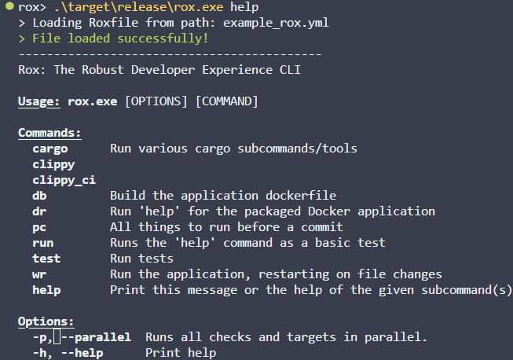

# Rox

Composable Dev Commands inspired by [Nox](https://nox.thea.codes/en/stable/), Make & [cargo-make](https://github.com/sagiegurari/cargo-make)

Rox gives you the ability to build your own CLI using YAML files, dynamically adding them to the `rox` command list. It's built with Rust, giving you fast startup times and cross-platform compabitility. Being both performant and flexible makes it easier for dev teams to standardize their workflows without writing endless "glue" scripts.

The subcommands and their help messages are automatically populated at runtime from the `name` and `description` of each `target`.

See the [roxfile.yml](roxfile.yml) for an idea of the planned end-state of syntax and functionality! This is also the Roxfile used for this repo.

## Getting Started

### Requirements

Until a proper release pipeline is set up, you'll need `cargo` to get things up and running. Once you've got that installed, clone this repo and run `cargo build`.

To play around further, you can either run `cargo run help` or execute the built binary within the `target/debug/` dir.

## Features

- [x] Enforce Version Requirements (by doing semver-style version comparison)
- [x] Enforce that certain files exist (i.e. a `.env` file)
- [x] Show elapsed time all commands
- [x] Command dependencies (pre/post targets)
- [ ] Supports Parallelization of Target Execution
- [ ] Parametrize Commands
- [ ] Supports Monorepos via `workdir` specification
- [ ] Cross-Platform
- [ ] Support Passing Inputs/Outputs
- [ ] Support Definitions in Multiple Files
- [ ] First-Class support for Git Operations?
